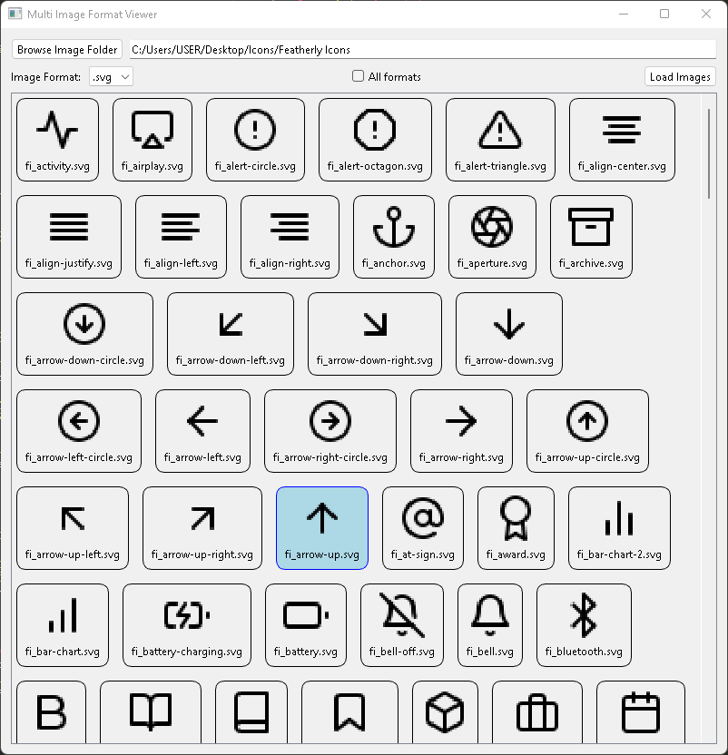

# Multi Image Format Viewer

## Overview

**Multi Image Format Viewer** is a PySide6 based GUI application designed to simplify the viewing of multiple SVG icon files. This tool was born out of frustration with the lack of efficient solutions for simultaneously viewing multiple SVG files, which is a common necessity in UI development.


## Features

- **View Multiple SVGs:** Easily load and view multiple SVG icon files at once.
- **User-Friendly Interface:** Simple and intuitive interface built with PySide6.
- **Supports Other Formats:** While primarily designed for SVGs, it supports other common image formats as well.

## Installation

1. **Clone the Repository:**

```sh
git clone https://github.com/prmpsmart/multi_image_format_viewer.git
cd multi_image_format_viewer
```

2. **Install Dependencies:**

Ensure you have Python 3.6+ and pip installed. Then, install the required packages:

```sh
pip install -r requirements.txt
```

3. **Run the Application:**

```sh
python main.py
```

## Usage

1. Launch the Application:

   After running main.py, the GUI will open.

2. Load Images:

   Use the file dialog to select and load multiple SVG files or other supported image formats.

3. View and Navigate:

   View the loaded images in the main window. Navigate through the images as needed for your development tasks.

## Motivation

The **Multi Image Format Viewer** was created out of the need for a straightforward tool to view multiple SVG icons concurrently. During UI development, it’s often necessary to compare and inspect various icons quickly, and existing solutions did not meet this need effectively. This tool aims to fill that gap, providing a seamless experience for developers.

## Contributions

Contributions are welcome! If you encounter any issues or have suggestions for improvements, please open an issue or submit a pull request.

## License

This project is licensed under the MIT License. See the LICENSE file for details.

## Acknowledgements

Special thanks to the contributors of PySide6 and the open-source community for providing the tools and libraries that made this project possible.
